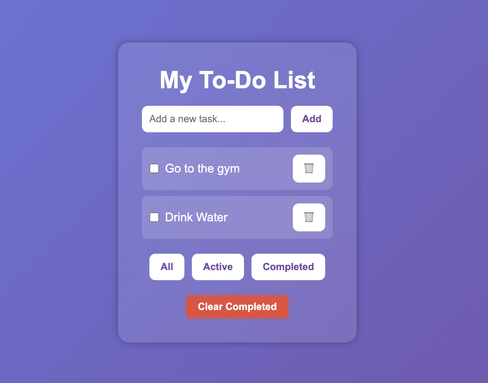

# To-do-List
A simple web-based to-do list application built with HTML, CSS, and JavaScript. 
This app helps you manage your tasks by allowing you to add, complete, delete, and filter tasks.

## Features
- Add new tasks
- Mark tasks as complete
- Delete individual tasks
- Clear all completed tasks
- Filter tasks by All, Active, or Completed
- Tasks are saved in the browser (localStorage) so they persist across sessions

## Demo

Live version: https://obinnayaokz.github.io/todo-list/

## How to Use
1. Clone the repository:
   git clone https://github.com/Obinnayaokz/todo-list.git
2. Open `index.html` in your browser.

## What I Learned
- What HTML actually does 
-How CSS controls spacing, layout, and design
-How JavaScript interacts with the DOM to make things change on screen
-What localStorage is and how to store data
-How filters work with arrays (filter, map)
